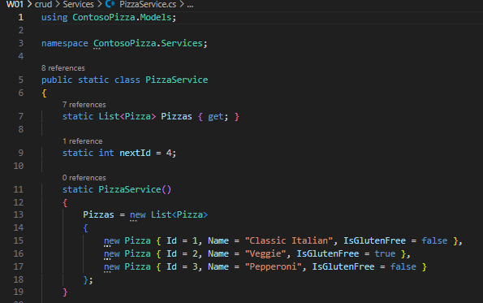

# CSE 325 Week 1 Assignment

## Part 1: Web API

### Additional Pizza Record

An additional pizza record was added to the `Pizzas` list in `PizzaService.cs`.

The additional record is:

* **ID:** 3
* **Name:** Pepperoni
* **IsGlutenFree:** false

Since the existing pizzas have IDs 1, 2, and 3, the next automatically generated ID for a newly created pizza is 4.

### API Testing

The RESTful Pizza API was tested using Swagger.

#### GET

**Request:** `GET /Pizza`

**Status Code:** `200 OK`

The GET request successfully returned the pizza records, including their IDs.

#### POST

**Request:** `POST /Pizza`

**Status Code:** `201 Created`

The POST request successfully created a new pizza record. The ID was automatically generated by the application.

#### PUT

**Request:** `PUT /Pizza/1`

**Status Code:** `204 No Content`

The PUT request successfully updated the pizza with ID 1.

#### DELETE

**Request:** `DELETE /Pizza/2`

**Status Code:** `204 No Content`

The DELETE request successfully deleted the pizza with ID 2.

---

## Part 2: Sales Summary

The following function generates a sales summary report containing the total sales and the sales total for each individual sales file.

### Sales Summary Function

```csharp
string CreateSalesSummary(IEnumerable<string> salesFiles)
{
    double salesTotal = 0;

    StringBuilder report = new StringBuilder();

    report.AppendLine("Sales Summary");
    report.AppendLine("----------------------------");

    foreach (var file in salesFiles)
    {
        string salesJson = File.ReadAllText(file);

        SalesData? data =
            JsonConvert.DeserializeObject<SalesData>(salesJson);

        double fileTotal = data?.Total ?? 0;

        salesTotal += fileTotal;

        report.AppendLine(
            $"{Path.GetRelativePath(currentDirectory, file)}: {fileTotal:C}"
        );
    }

    report.AppendLine();
    report.AppendLine($"Total Sales: {salesTotal:C}");

    return report.ToString();
}
```

### Additional Pizza Record

I completed the Microsoft Learn module "Create a web API with ASP.NET Core controllers."

The module originally included the following pizza records:

- ID: 1
  - Name: Classic Italian
  - IsGlutenFree: false
- ID: 2
  - Name: Veggie
  - IsGlutenFree: true

I added the following additional record to the `Pizzas` list in `PizzaService.cs`:

- ID: 3
  - Name: Pepperoni
  - IsGlutenFree: false

### Evidence from the Microsoft Learn Module

The screenshot below shows the end of the Microsoft Learn module "Create a web API with ASP.NET Core controllers."


The screenshot below shows the existing pizza records and the additional Pepperoni record added to `PizzaService.cs`.

